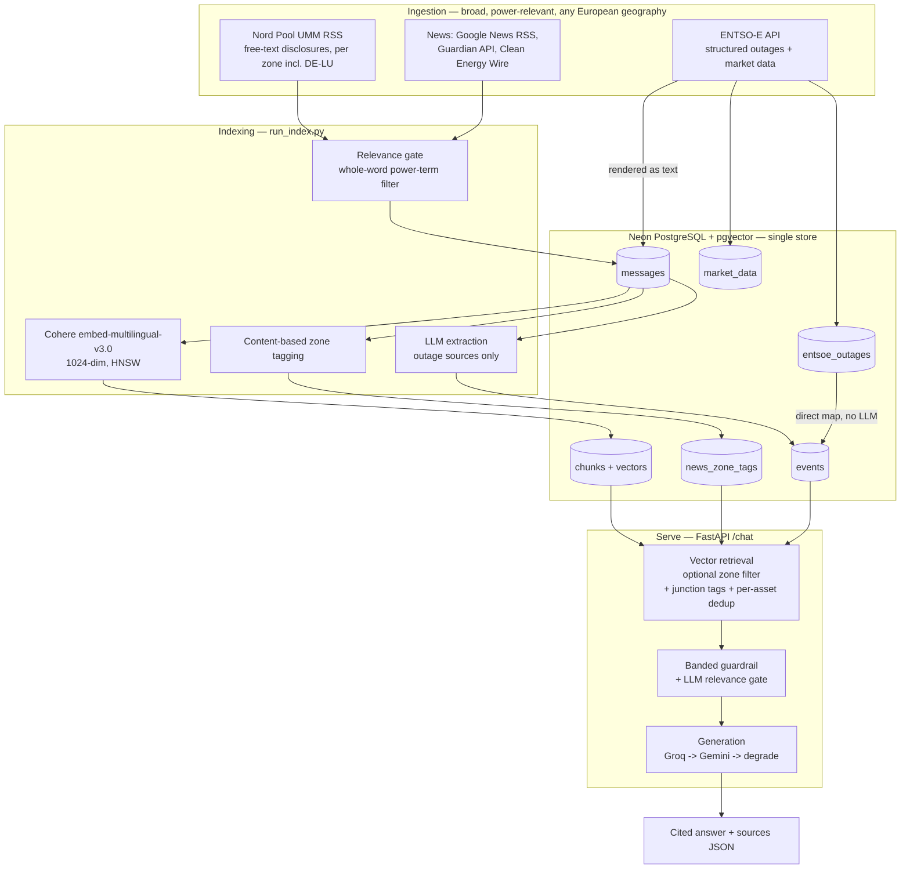

# Agentic Power-Market Analyst — Design & Testing Document

**Author:** Amalie Berg · MSSE Capstone (solo) · Living document — *updated through Sprint 2.*

Repository: `AmalieBerg/Capstone-MSSE-Quantic` · Deployed on Render (FastAPI).

---

## 1. System overview

The Agentic Power-Market Analyst is a Retrieval-Augmented Generation (RAG) system that answers
natural-language questions about the European electricity market, grounded in a live corpus of
structured outage data, outage-disclosure messages, and curated energy news. It ingests structured
outage data (ENTSO-E Transparency) and market time series, outage disclosure messages (REMIT/ACER
Urgent Market Messages via Nord Pool), and power-market news (Google News, the Guardian API, Clean
Energy Wire), extracts structured events, indexes both text and structured records, and answers
questions with **grounded, cited** responses — or an honest **refusal** when the corpus does not
support the question — through a deployed web app and JSON API.

The system covers three bidding zones — **DE-LU** (Germany–Luxembourg), **DK1** (West Denmark), and
**NO2** (South Norway). These were chosen to exercise both zone-specific retrieval (DK1, NO2) and
cross-zonal interconnector reasoning (DE-LU sits at the centre of several cross-border links). The
three zones are a deliberate **starting point**: a Sprint-2 architectural pivot (§4) makes zone an
*optional query-time filter* rather than an ingestion-time boundary, so expanding toward full
pan-European coverage is a matter of adding data and tags, not re-engineering the pipeline.

**Mission.** *Enable a power-market analyst to ask, in plain language, what is happening with
generation and transmission availability across European bidding zones, and receive a grounded,
cited, trustworthy answer — or an honest refusal when the corpus does not contain the information.*

---

## 2. Architecture

### 2.1 Data flow

### 2.2 Storage — Neon Postgres + pgvector (single store)

A single Neon Postgres database with the `pgvector` extension holds everything, collapsing the vector
store and relational store into one system. Tables:

- `market_data` — tidy ENTSO-E time series (day-ahead price, load/wind/solar forecast, generation).
- `entsoe_outages` — structured generation-unit outages as JSONB, deduped on a natural key.
- `messages` — the retrieval corpus (outage disclosures + news; text loaded at runtime, never committed).
- `chunks` — embedded text chunks + an HNSW cosine index.
- `events` — structured `OutageEvent` rows, joined to `messages` via `source_id`.
- `news_zone_tags` *(Sprint 2)* — many-to-many junction associating one news item with one or more zones.

### 2.3 External services

- **Embeddings:** Cohere `embed-multilingual-v3.0` (1024-dim; the corpus mixes EN/DE/NO/DK).
- **LLM:** Groq (`openai/gpt-oss-120b`) primary, Google Gemini (`gemini-2.5-flash`, `google-genai`
  SDK) fallback on rate-limit, degrading gracefully to a clean "temporarily unavailable" message if
  both providers fail.
- **Deployment:** Render (web service) running `uvicorn app:app`; GitHub Actions for CI.

---

## 3. Component design

### 3.1 Ingestion (E1)

**U1.1 — ENTSO-E client.** Fetches market series and generation-unit outages per zone, throttled below
the 400 req/min limit with exponential-backoff retries, and upserts idempotently into `market_data`
and `entsoe_outages`. The same client is reused by the future agent tool (U7.1).

**U1.2 — Outage message ingestion.** Builds the `messages` corpus as a **union** of two sources:
(a) ENTSO-E structured outages rendered as text messages, and (b) configured UMM feeds. In Sprint 1
the German zone had no working UMM feed; a **Sprint-2 fix** added DE-LU to the Nord Pool UMM feed
(same proven `nordpool_umm` path, area = `10Y1001A1001A82H`), so all three zones now carry genuine
free-text disclosures. Feeds are fetched with explicit timeouts and retries; a failed feed is skipped,
not fatal. `remit.py` parses the REMIT UMM Electricity Schema V3 (asset, capacity, fuel, window,
bidding zone, narrative *reason*), and skips dismissed/withdrawn messages.

**U1.3 — News ingestion *(Sprint 2)*.** A `NEWS_FEEDS` inlet pulls power-market news from Google News
RSS (query-scoped per zone), the Guardian Content API (full body text, open licence), and Clean Energy
Wire RSS. News is routed through the shared `fetch_feed`/`upsert_messages` path with `source` tagging,
passes a relevance gate (§3.6), and — importantly — is **excluded from outage extraction**: it is
embedded for retrieval but not run through the `OutageEvent` extractor, which would produce garbage on
journalistic prose. Only title + snippet are stored for RSS sources (licensing); the Guardian's open
licence permits full body text.

**U1.4 — Frozen evaluation snapshot *(Sprint 2)*.** The corpus is exported to a versioned JSONL
snapshot (`data/snapshot/`, ~11 MB, committed) with a restore script, so the evaluation runs against a
fixed, reproducible corpus rather than one that shifts as live feeds update. A `CORPUS_FROZEN` guard
blocks accidental re-ingestion. The snapshot includes embeddings, so a grader can restore and query the
exact corpus without a Cohere key.

### 3.2 Extraction (E2)

**U2.1 — Structured event extraction.** Two paths, by source type:

- **Structured ENTSO-E outages -> mapped directly to `OutageEvent`, no LLM.** The data is already
  structured (asset, `nominal_power`, `plant_type`, start/end), so an LLM call would only add cost and
  hallucination risk. Direct mapping is more accurate and free.
- **Free-text messages (UMM) -> LLM extraction.** The LLM fills only the genuinely natural-language
  fields; zone, source URL, and `source_id` are filled deterministically from the row. Output is
  validated with Pydantic; failures are logged, never fatal to the batch. A `field_validator` coerces
  a missing asset to `"unknown unit"` so an unparseable disclosure degrades rather than dropping.

**U2.2 — News zone-tagging *(Sprint 2)*.** News items are tagged to bidding zones by a content scan
(country/TSO names, not EIC codes — journalistic text never uses REMIT codes) into the
`news_zone_tags` junction table, so one article can associate with multiple zones. **Asset-level
linking was evaluated and descoped**: ENTSO-E/REMIT asset identifiers (e.g.
`11T0-0000-0024-8 : Brunsbüttel`) do not occur in prose — an `ILIKE` asset-name join returned 0
matches across the news corpus — so news<->event association is maintained at zone granularity, with
semantic retrieval surfacing news without explicit asset links.

### 3.3 Indexing (E3)

**U3.1 — Chunking + embeddings.** Deterministic char-based chunking with overlap; Cohere embeddings
batched (<=96/call) with 60-second backoff on rate-limit. Stored in `chunks` with an HNSW
`vector_cosine_ops` index. Indexing is **incremental** — only messages not already chunked are
embedded — to conserve free-tier embedding quota.

**U3.2 — Structured event store.** `events` table, with `source_id` joining each event back to its
`messages` row — the linkage that makes citations and retrieval-dedup precise.

**U3.3 — Hybrid retrieval (vector-first).** Runs cosine vector search over `chunks` (HNSW); attaches
each hit's structured event by `message_id`; dedups by asset, keeping the highest-scoring window per
unit. **Sprint-2 changes:** (a) zone is now an **explicit optional parameter** (`retrieve(zone=…)`) as
well as being detectable from the question text — no zone means pan-European relevance search; (b) the
zone filter consults `news_zone_tags` (via an `EXISTS` sub-query) in addition to a chunk's native zone,
so cross-zonal tagged content surfaces for every zone it concerns. Ranked/aggregate questions
("biggest outage") are deliberately *not* handled here — they belong to the structured agent tool
(U7.1), which can `ORDER BY capacity`.

### 3.4 Generation (E4)

**U4.1 — Cited answers.** Retrieved items are formatted into a numbered context; the LLM answers
**only** from those sources and cites inline with `[n]`; citations are mapped back to source URLs /
descriptors and now carry the `message_id` (Sprint 2) so answers are traceable to exact corpus rows.

**U4.2 — Guardrails (banded, *revised in Sprint 2*).** Calibration against the gold set (§6.2) showed a
single cosine threshold could not cleanly separate in-corpus from out-of-corpus questions — their score
distributions overlap. The guardrail was therefore rebuilt as **three bands** on the top retrieval
score: below `RELEVANCE_LOW` (0.45) refuse with no LLM call; above `RELEVANCE_HIGH` (0.60) answer
directly; in the ambiguous middle band an **LLM relevance gate** judges whether the question is in
scope (correct region/commodity/time period). This spends an LLM call only on genuinely ambiguous
queries and catches semantically-near but out-of-scope questions (e.g. "Texas ERCOT outages") that a
threshold alone wrongly answers. Output length is capped; a `refused` flag is returned; and if the LLM
is unavailable the request degrades to a clean message rather than a 500.

### 3.5 App & deployment (E5/E6)

**U5.1 — FastAPI app.** `GET /` serves a minimal HTML chat page (shareable URL); `POST /chat` returns
JSON `{answer, citations, snippets, refused}` and now accepts an optional `zone` (Sprint 2);
`GET /health` returns liveness JSON without touching the DB.

**U6.1 — Render deployment.** `uvicorn app:app`; secrets via environment variables. Because Neon is a
persistent store, the data and vector index survive restarts.

**U6.2 — CI.** GitHub Actions installs dependencies and runs the test suite on push/PR.

### 3.6 Relevance filtering (E1, *Sprint 2*)

News quality is enforced by **layered filtering**, added in response to observed contamination classes:

- a **whole-word power-term gate** (`_is_energy_relevant`) — an item must contain a power-system term
  (electricity, grid, generation, MW, renewable, nuclear, hydro, …); this rejects macro/geopolitics
  articles that only mention "oil"/"gas"/"price";
- a **stricter lead-window gate** (`_is_energy_headline`) for full-text Guardian articles — the signal
  must appear in the title or first ~400 characters, not buried deep in a long body;
- a **negative-query filter** on the Guardian API (`AND NOT (review OR theatre OR music OR …)`) to
  exclude culture-desk content at the source.

Zone geography terms live in a single `config.GEO_TERMS` registry read by both news tagging (names
only — safe for scanning article text) and retrieval zone-detection (names + short codes — safe for
scanning a user query, where "NO2" unambiguously means the zone).

---

## 4. Key design decisions (decision log)

| # | Decision | Rationale |
|---|----------|-----------|
| D2 | Zones DE-LU, DK1, NO2 | DE-LU for outage/news richness and cross-zonal links; DK1 for high wind share + Nordic coupling; NO2 for domain fluency. A deliberate starting point, not a fixed boundary. |
| D4 | Raw third-party text loaded at runtime; only derived data/embeddings stored | Respects data licensing; the repo holds no redistributable raw text. |
| — | Neon Postgres + pgvector as a single store | Avoids dual vector+relational complexity; per-query auto-wake suits the free tier. |
| — | Outage dedup on a stable natural key (`zone\|unit\|start\|end`), not a content hash | Content hashing over volatile `mrid`/`revision` fields made every revision a new row; the natural key collapses revisions to one outage. Cancelled/withdrawn disclosures dropped; latest revision wins. |
| — | Structured vs free-text event split | ENTSO-E outages are already structured -> map directly (accurate, zero LLM cost); reserve the LLM for genuinely unstructured UMM/news text. |
| — | Incremental indexing | `run_index` processes only new messages, preventing full-corpus reprocessing from exhausting Cohere/Groq free-tier quotas. |
| — | Vector-first retrieval + per-asset dedup | Semantic relevance leads; events attach to their chunks; repeated windows of one unit collapse. |
| — | **Geography filtered at query time, not ingestion time** *(Sprint 2 pivot)* | Ingest broadly (power-relevant, any geography), tag by zone, filter on retrieval. Makes "one zone" and "all of Europe" the same code path with a parameter, and makes expansion a data/tag change, not a re-ingest. An earlier ingestion-time geography gate was removed because it hard-coded the three-zone scope. |
| — | **Banded guardrail + LLM relevance gate** *(Sprint 2)* | A single cosine threshold cannot separate in- from out-of-corpus questions (overlapping score distributions); the banded gate spends an LLM call only on the ambiguous middle and catches semantically-near out-of-scope questions. |
| — | **News junction-table tagging; asset-linking descoped** *(Sprint 2)* | One article can concern several zones; a `zone` column cannot express that. Asset-level linking returned 0 matches (REMIT codes absent from prose), so association is kept at zone granularity. |
| — | **Fallback chain with graceful degradation** *(Sprint 2)* | Free-tier providers have hard daily quotas; Groq->Gemini->clean-degrade keeps the service responsive and prevents unhandled 500s. |
| — | Guardrail refuses before the LLM call | Prevents hallucinated answers to out-of-corpus questions and saves tokens. |
| — | Directional price prediction ruled out | No defensible edge with public-only data; the day-ahead price already embeds available fundamentals. |
| — | Lexical/keyword retrieval deferred | Dense retrieval is weak on bare proper nouns / unit codes; exact-name lookups are served more precisely by the U7.1 structured tool (`events.asset ILIKE`). |
| — | IIP REMIT feed treated as incremental, not load-bearing | It proved thin/intermittently empty; DE-LU free-text now comes from Nord Pool + news, structured coverage from ENTSO-E. |

---

## 5. Scope by sprint

- **Sprint 1** — a thin, live, end-to-end slice, protected above all as **deployed + tested**. Delivered
  ahead of scope: all three zones (not DE-LU only) and a REMIT-XML parser.
- **Sprint 2** — breadth, news, and evaluation: DE-LU free-text via Nord Pool; the news inlet (U1.3) and
  zone-tagging (U2.2); the pan-European query-time-filter pivot; the frozen evaluation snapshot (U1.4);
  the gold set and metrics (U8); and the banded guardrail with a calibrated refusal threshold.
- **Sprint 3 (planned)** — the tool-calling agent for live ENTSO-E figures and structured lookups (U7.1);
  optional lexical retrieval; the recorded presentation.

---

## 6. Testing strategy

**Principle.** Pure, deterministic logic is unit-tested offline (no network, no DB, no live LLM — the
LLM is supplied by dependency injection); integration is verified by running each user story against
live Neon + APIs and confirming results via SQL; the end-to-end system is measured by a reproducible
evaluation harness against a frozen corpus. CI gates the offline suite on every push.

### 6.1 Offline unit tests (run in CI)

- `test_outages` / `test_outages_dedup` — normalisation helpers; natural-key dedup; cancelled-message filtering.
- `test_extraction` — prompt building, JSON parsing/fence-stripping, field merge, failure logging; missing-asset coercion.
- `test_index` — chunking (overlap, edges), pgvector formatting, deterministic ids, event-row mapping.
- `test_retrieval` — zone detection (incl. substring false-match guard), per-asset dedup, event attach.
- `test_generation` — context formatting, citation extraction, guardrail refusal, length cap.
- `test_app` — `/health`, HTML at `/`, `/chat` response shaping.
- `test_geo_terms` *(Sprint 2)* — the `GEO_TERMS` registry and `zone_terms()`: codes included/excluded per flag, TSO names, registry shape.
- `test_relevance_filter` *(Sprint 2)* — the energy-relevance gates, with the specific contamination cases found in development (sport, politics, macro) locked in as regression assertions.
- `test_guardrail_bands` *(Sprint 2)* — all three guardrail bands with an injected fake LLM: no-LLM refusal below LOW, answer above HIGH, gate decision in the middle band, graceful degradation on LLM failure, and citation extraction.

### 6.2 End-to-end evaluation (U8, *Sprint 2*)

A 30-question **gold set** (`data/eval/gold.jsonl`), stratified across five behaviours —
structured-outage (8), free-text UMM (8), cross-zonal (6), news (3), and out-of-corpus refusal (5) —
is run against the live `/chat` endpoint by `run_eval.py`. Each answerable question is grounded in
specific message IDs in the **frozen** corpus (§3.1, U1.4), so results are reproducible. The harness
runs two passes (explicit zone / inferred zone) and scores:

- **refusal_correct** — did the system refuse exactly the out-of-corpus questions;
- **citation_hit** — did retrieval surface a supporting passage;
- **fact_match** — fraction of expected facts present in the answer;
- **groundedness** — LLM-judged: are the answer's claims supported by the retrieved snippets;
- **latency** — per-request p50 / p95.

**A note on citation scoring.** The corpus contains many revised disclosures per physical asset
(e.g. 9 Neurath messages, 61 Brunsbüttel). Strict exact-message-ID recall therefore *understates*
retrieval quality, because the retriever legitimately surfaces a *sibling* revision of the correct
outage. Two figures are reported: strict exact-ID recall, and **asset-level recall** (a hit is credited
when the cited message describes the same asset as the gold message). Asset-level recall measures the
question that actually matters — *was the correct outage surfaced* — and is the primary figure.

### 6.3 Results (frozen corpus, explicit-zone run)

| Metric | Value |
|---|---|
| Refusal correctness | 0.97 |
| Citation recall (asset-level) | 0.90 |
| Citation recall (strict exact-ID) | 0.63 |
| Fact match | 0.86 |
| Groundedness (LLM-judged, n=24) | 0.78 |
| Latency p50 / p95 | 0.9 s / 9.2 s |

Per-category citation recall (asset-level): structured-outage 0.62, free-text UMM 1.00, cross-zonal
1.00, news 1.00, refusal 1.00.

**Interpretation.** Refusal is near-perfect (29/30; the single miss is a borderline *existence*
question — "are there *any* lignite outages?" — that the semantic gate conservatively declined, a safe
failure mode). Free-text, cross-zonal, and news retrieval are fully accurate at asset level.
Structured-outage recall is lower (0.62) because several structured questions are broad ("what outages
affect southern Norway?") and the retriever surfaces a different *valid* outage than the one marked
gold — a gold-set scoring artifact rather than a retrieval failure. Groundedness of 0.78 indicates
answers are well-supported by retrieved context.

### 6.4 CI

GitHub Actions installs dependencies and runs `pytest` on push/PR. *(Branch protection requiring the
check before merge is the remaining toggle to fully enforce the gate.)*

---

## 7. Known limitations & roadmap

**Limitations:**

- **Lexical relevance filtering** cannot perfectly separate power news from incidental keyword matches
  (e.g. "grid power" vs "star power"); a lightweight LLM relevance classifier is the production upgrade.
- **DK1 news coverage is thin** — Danish-specific power news is sparse in free feeds, so DK1 questions
  lean on Nord Pool UMMs and structured data. Accurate to the data, documented for transparency.
- **Cross-zonal disclosures** are stored once and tagged to a single zone on a first-feed-wins basis,
  but remain retrievable across zones via semantic search and the junction table.
- Dense retrieval is weak on bare proper-noun queries (e.g. "Boxberg"); mitigated later by the U7.1 structured tool.
- ENTSO-E names both Boxberg blocks "KW Boxberg", so asset-name dedup collapses distinct units; `production_resource_id` distinguishes them if unit-level granularity is wanted.
- Refusal calibration rests on a narrow score gap and a small probe set; the banded gate mitigates this but a larger labelled set would tighten it.
- One event per message (multi-unit messages deferred).
- Free-tier cold starts (Render spins down; Neon scales to zero) — the first request after idle is slow.

**Pan-European expansion** — the intended trajectory — is architecturally supported (query-time zone
filtering, junction-table tagging, multilingual embeddings, the `GEO_TERMS` registry). Three concrete
prerequisites for scale-out: (1) **paid embeddings**, since ~30 zones would exceed Cohere trial limits;
(2) a **zone-registry refactor** so zones are configuration rather than hand-written entries; (3) a
**language-agnostic relevance gate** (LLM-based) to replace English keyword lists as non-English
sources are added.

**Roadmap (Sprint 3):** the tool-calling agent for live ENTSO-E figures and structured lookups (U7.1);
optional lexical retrieval; CD on merge and branch protection; the finalised recorded presentation.