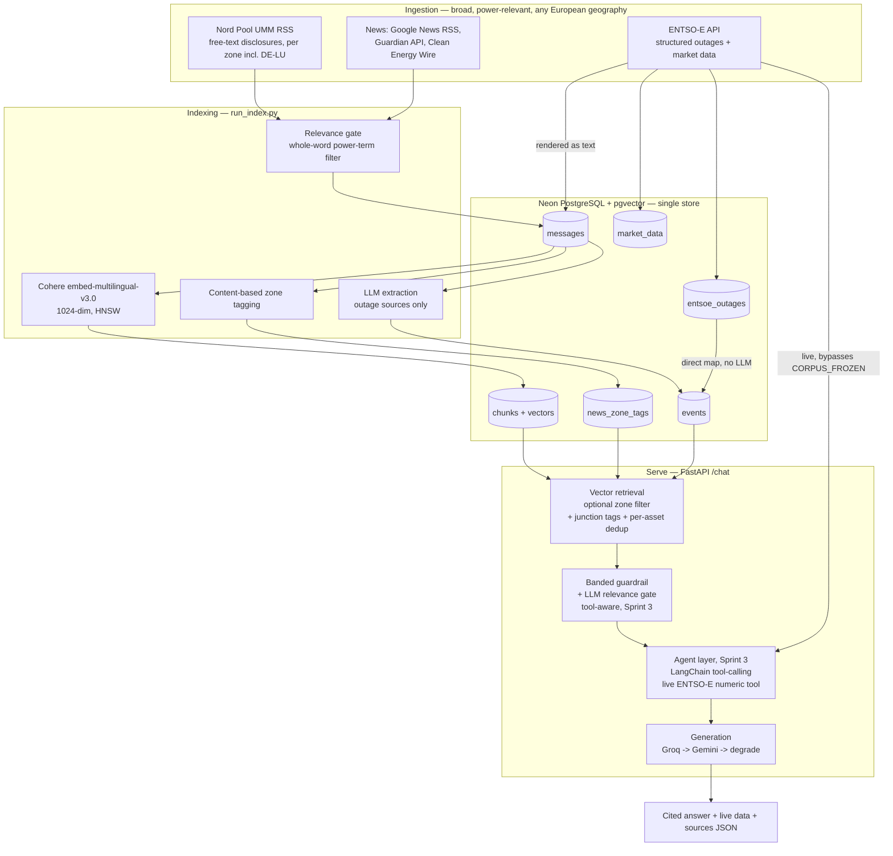

# Agentic Power-Market Analyst — Design & Testing Document

**Author:** Amalie Berg · MSSE Capstone (solo) · Final — *complete through Sprint 3.*

Repository: `AmalieBerg/Capstone-MSSE-Quantic` · Deployed on Render (FastAPI).
Live URL: https://capstone-msse-quantic.onrender.com

---

## 1. System overview

The Agentic Power-Market Analyst is a Retrieval-Augmented Generation (RAG) system, extended in
Sprint 3 with a tool-calling agent layer, that answers natural-language questions about the
European electricity market. It is grounded in a live corpus of structured outage data,
outage-disclosure messages, and curated energy news, and additionally reasons over **live**
ENTSO-E numeric data (day-ahead price, generation, load and wind/solar forecasts) via a dedicated
agent tool. It ingests structured outage data (ENTSO-E Transparency) and market time series,
outage disclosure messages (REMIT/ACER Urgent Market Messages via Nord Pool), and power-market
news (Google News, the Guardian API, Clean Energy Wire), extracts structured events, indexes both
text and structured records, and answers questions with **grounded, cited** responses — or an
honest **refusal** when the corpus does not support the question — through a deployed web app and
JSON API.

The system covers three bidding zones — **DE-LU** (Germany–Luxembourg), **DK1** (West Denmark), and
**NO2** (South Norway). These were chosen to exercise both zone-specific retrieval (DK1, NO2) and
cross-zonal interconnector reasoning (DE-LU sits at the centre of several cross-border links). The
three zones are a deliberate **starting point**: a Sprint-2 architectural pivot (§4) makes zone an
*optional query-time filter* rather than an ingestion-time boundary, so expanding toward full
pan-European coverage is a matter of adding data and tags, not re-engineering the pipeline.

**Mission.** *Enable a power-market analyst to ask, in plain language, what is happening with
generation and transmission availability across European bidding zones — including right now —
and receive a grounded, cited, trustworthy answer, or an honest refusal when neither the corpus
nor live data can answer it.*

---

## 2. Architecture

### 2.1 Data flow

### 2.2 Storage — Neon Postgres + pgvector (single store)

A single Neon Postgres database with the `pgvector` extension holds everything, collapsing the vector
store and relational store into one system. Tables:

- `market_data` — tidy ENTSO-E time series (day-ahead price, load/wind/solar forecast, generation).
- `entsoe_outages` — structured generation-unit outages as JSONB, deduped on a natural key.
- `messages` — the retrieval corpus (outage disclosures + news; text loaded at runtime, never committed).
- `chunks` — embedded text chunks + an HNSW cosine index.
- `events` — structured `OutageEvent` rows, joined to `messages` via `source_id`.
- `news_zone_tags` *(Sprint 2)* — many-to-many junction associating one news item with one or more zones.

**Sprint 3 note:** the agent's live numeric tool (§8.2) intentionally does **not** add a new table
or write path. It queries ENTSO-E directly and holds results in memory only, by design — see §8.2
for why this is a deliberate architectural choice, not an omission.

### 2.3 External services

- **Embeddings:** Cohere `embed-multilingual-v3.0` (1024-dim; the corpus mixes EN/DE/NO/DK).
- **LLM:** Groq (`openai/gpt-oss-120b`) primary, Google Gemini (`gemini-2.5-flash`, `google-genai`
  SDK) fallback on rate-limit, degrading gracefully to a clean "temporarily unavailable" message if
  both providers fail. *(Sprint 3: on the agent path, Gemini fallback additionally degrades to
  retrieval-only, since tools are bound to Groq only — see §8.1.)*
- **Agent orchestration** *(Sprint 3)*: LangChain (`bind_tools()`, `.with_fallbacks()`) with a
  hand-wired tool-dispatch loop — see §8.1 for the full rationale.
- **Deployment:** Render (web service) running `uvicorn app:app`; GitHub Actions for CI + auto-deploy
  on push.

---

## 3. Component design

### 3.1 Ingestion (E1)

**U1.1 — ENTSO-E client.** Fetches market series and generation-unit outages per zone, throttled below
the 400 req/min limit with exponential-backoff retries, and upserts idempotently into `market_data`
and `entsoe_outages`. The same client is reused directly by the Sprint-3 agent tool (§8.2) — no
duplicated fetch logic between batch ingestion and the live-query path.

**U1.2 — Outage message ingestion.** Builds the `messages` corpus as a **union** of two sources:
(a) ENTSO-E structured outages rendered as text messages, and (b) configured UMM feeds. In Sprint 1
the German zone had no working UMM feed; a **Sprint-2 fix** added DE-LU to the Nord Pool UMM feed
(same proven `nordpool_umm` path, area = `10Y1001A1001A82H`), so all three zones now carry genuine
free-text disclosures. Feeds are fetched with explicit timeouts and retries; a failed feed is skipped,
not fatal. `remit.py` parses the REMIT UMM Electricity Schema V3 (asset, capacity, fuel, window,
bidding zone, narrative *reason*), and skips dismissed/withdrawn messages.

**U1.3 — News ingestion *(Sprint 2)*.** A `NEWS_FEEDS` inlet pulls power-market news from Google News
RSS (query-scoped per zone), the Guardian Content API (full body text, open licence), and Clean Energy
Wire RSS. News is routed through the shared `fetch_feed`/`upsert_messages` path with `source` tagging,
passes a relevance gate (§3.6), and — importantly — is **excluded from outage extraction**: it is
embedded for retrieval but not run through the `OutageEvent` extractor, which would produce garbage on
journalistic prose. Only title + snippet are stored for RSS sources (licensing); the Guardian's open
licence permits full body text.

**U1.4 — Frozen evaluation snapshot *(Sprint 2)*.** The corpus is exported to a versioned JSONL
snapshot (`data/snapshot/`, ~11 MB, committed) with a restore script, so the evaluation runs against a
fixed, reproducible corpus rather than one that shifts as live feeds update. A `CORPUS_FROZEN` guard
blocks accidental re-ingestion. The snapshot includes embeddings, so a grader can restore and query the
exact corpus without a Cohere key. *(Sprint 3 preserved this deliberately unchanged — see §8.2 for
why the agent's live-data capability had to be built around this freeze rather than through it.)*

### 3.2 Extraction (E2)

**U2.1 — Structured event extraction.** Two paths, by source type:

- **Structured ENTSO-E outages -> mapped directly to `OutageEvent`, no LLM.** The data is already
  structured (asset, `nominal_power`, `plant_type`, start/end), so an LLM call would only add cost and
  hallucination risk. Direct mapping is more accurate and free.
- **Free-text messages (UMM) -> LLM extraction.** The LLM fills only the genuinely natural-language
  fields; zone, source URL, and `source_id` are filled deterministically from the row. Output is
  validated with Pydantic; failures are logged, never fatal to the batch. A `field_validator` coerces
  a missing asset to `"unknown unit"` so an unparseable disclosure degrades rather than dropping.

**U2.2 — News zone-tagging *(Sprint 2)*.** News items are tagged to bidding zones by a content scan
(country/TSO names, not EIC codes — journalistic text never uses REMIT codes) into the
`news_zone_tags` junction table, so one article can associate with multiple zones. **Asset-level
linking was evaluated and descoped**: ENTSO-E/REMIT asset identifiers (e.g.
`11T0-0000-0024-8 : Brunsbüttel`) do not occur in prose — an `ILIKE` asset-name join returned 0
matches across the news corpus — so news<->event association is maintained at zone granularity, with
semantic retrieval surfacing news without explicit asset links.

### 3.3 Indexing (E3)

**U3.1 — Chunking + embeddings.** Deterministic char-based chunking with overlap; Cohere embeddings
batched (<=96/call) with 60-second backoff on rate-limit. Stored in `chunks` with an HNSW
`vector_cosine_ops` index. Indexing is **incremental** — only messages not already chunked are
embedded — to conserve free-tier embedding quota.

**U3.2 — Structured event store.** `events` table, with `source_id` joining each event back to its
`messages` row — the linkage that makes citations and retrieval-dedup precise.

**U3.3 — Hybrid retrieval (vector-first).** Runs cosine vector search over `chunks` (HNSW); attaches
each hit's structured event by `message_id`; dedups by asset, keeping the highest-scoring window per
unit. **Sprint-2 changes:** (a) zone is now an **explicit optional parameter** (`retrieve(zone=…)`) as
well as being detectable from the question text — no zone means pan-European relevance search; (b) the
zone filter consults `news_zone_tags` (via an `EXISTS` sub-query) in addition to a chunk's native zone,
so cross-zonal tagged content surfaces for every zone it concerns. Ranked/aggregate questions
("biggest outage") remain deliberately outside this module's scope, same as originally planned;
in practice the Sprint-3 agent tool answers *numeric* ranked questions (e.g. current price
comparisons) rather than corpus-side capacity ranking, which stayed out of scope for Sprint 3.

### 3.4 Generation (E4)

**U4.1 — Cited answers.** Retrieved items are formatted into a numbered context; the LLM answers
**only** from those sources and cites inline with `[n]`; citations are mapped back to source URLs /
descriptors and carry the `message_id` (Sprint 2) so answers are traceable to exact corpus rows.
*(Sprint 3: the agent path reuses this exact formatting and citation-extraction logic unchanged —
see §8.1 — so both paths produce an identical citation contract.)*

**U4.2 — Guardrails (banded, revised in Sprint 2, extended in Sprint 3).** Calibration against the
gold set (§6.2) showed a single cosine threshold could not cleanly separate in-corpus from
out-of-corpus questions — their score distributions overlap. The guardrail was rebuilt as **three
bands** on the top retrieval score: below `RELEVANCE_LOW` (0.45) refuse with no LLM call; above
`RELEVANCE_HIGH` (0.60) answer directly; in the ambiguous middle band an **LLM relevance gate**
judges whether the question is in scope (correct region/commodity/time period). These specific threshold values were derived empirically, not chosen by inspection — scripts/calibrate_threshold.py runs a set of known-refusal and known-answerable questions against live retrieval, reports the maximum refusal score and minimum answerable score, and checks whether a clean separating band exists between them. Output length is
capped; a `refused` flag is returned; and if the LLM is unavailable the request degrades to a
clean message rather than a 500. **Sprint 3 extended this system with a tool-aware gate** for the
agent path, so a pure live-numeric question (no text-corpus match at all) isn't wrongly refused —
full account of the fix, including two documented false starts, in §8.3.

**MIN_RELEVANCE recalibration — closed on evidence, Sprint 3.** This threshold was tracked as an
open item carried from Sprint 2. Confirmed during Sprint 3 that the band values above still hold
against the expanded 34-question gold set with no regression (`refusal_correct: 0.94`); no further
tuning was needed.

### 3.5 App & deployment (E5/E6)

**U5.1 — FastAPI app.** `GET /` serves an HTML chat page with example-question chips and a
live/corpus/refused status badge *(Sprint 3, §8.7)*; `POST /chat` returns JSON
`{answer, citations, snippets, refused, used_tool, tool_result}` (the last two added in Sprint 3)
and accepts an optional `zone`; `GET /health` returns liveness JSON without touching the DB.

**U6.1 — Render deployment.** `uvicorn app:app`; secrets via environment variables. Because Neon is a
persistent store, the data and vector index survive restarts.

**U6.2 — CI.** GitHub Actions installs dependencies and runs the test suite on push/PR.

**U6.3 — Scheduled ingestion / CD *(Sprint 3, closed on evidence rather than built)*.** Originally
planned as a GitHub Actions cron plus auto-deploy on merge. Auto-deploy was confirmed already
working via Render's existing push-triggered deploy — no new work needed. Scheduled ingestion was
found to directly conflict with `CORPUS_FROZEN` (a cron calling `ingest()` would fail every run)
and to be unnecessary once the Sprint-3 agent's live-tool path existed, which solves numeric
freshness per-query without touching the frozen corpus at all. See §8.2.

**U6.4 — Cold-start decision *(Sprint 3)*.** Render free-tier cold start measured directly at
~32.7s on `/health` alone versus ~90-150ms warm. Decided against the paid Starter tier in favor of
a UX fix; full reasoning in §8.7.

### 3.6 Relevance filtering (E1, Sprint 2)

News quality is enforced by **layered filtering**, added in response to observed contamination classes:

- a **whole-word power-term gate** (`_is_energy_relevant`) — an item must contain a power-system term
  (electricity, grid, generation, MW, renewable, nuclear, hydro, …); this rejects macro/geopolitics
  articles that only mention "oil"/"gas"/"price";
- a **stricter lead-window gate** (`_is_energy_headline`) for full-text Guardian articles — the signal
  must appear in the title or first ~400 characters, not buried deep in a long body;
- a **negative-query filter** on the Guardian API (`AND NOT (review OR theatre OR music OR …)`) to
  exclude culture-desk content at the source.

Zone geography terms live in a single `config.GEO_TERMS` registry read by both news tagging (names
only — safe for scanning article text) and retrieval zone-detection (names + short codes — safe for
scanning a user query, where "NO2" unambiguously means the zone).

---

## 4. Key design decisions (decision log)

| # | Decision | Rationale |
|---|----------|-----------|
| D2 | Zones DE-LU, DK1, NO2 | DE-LU for outage/news richness and cross-zonal links; DK1 for high wind share + Nordic coupling; NO2 for domain fluency. A deliberate starting point, not a fixed boundary. |
| D4 | Raw third-party text loaded at runtime; only derived data/embeddings stored | Respects data licensing; the repo holds no redistributable raw text. |
| — | Neon Postgres + pgvector as a single store | Avoids dual vector+relational complexity; per-query auto-wake suits the free tier. |
| — | Outage dedup on a stable natural key (`zone\|unit\|start\|end`), not a content hash | Content hashing over volatile `mrid`/`revision` fields made every revision a new row; the natural key collapses revisions to one outage. Cancelled/withdrawn disclosures dropped; latest revision wins. |
| — | Structured vs free-text event split | ENTSO-E outages are already structured -> map directly (accurate, zero LLM cost); reserve the LLM for genuinely unstructured UMM/news text. |
| — | Incremental indexing | `run_index` processes only new messages, preventing full-corpus reprocessing from exhausting Cohere/Groq free-tier quotas. |
| — | Vector-first retrieval + per-asset dedup | Semantic relevance leads; events attach to their chunks; repeated windows of one unit collapse. |
| — | **Geography filtered at query time, not ingestion time** *(Sprint 2 pivot)* | Ingest broadly (power-relevant, any geography), tag by zone, filter on retrieval. Makes "one zone" and "all of Europe" the same code path with a parameter, and makes expansion a data/tag change, not a re-ingest. An earlier ingestion-time geography gate was removed because it hard-coded the three-zone scope. |
| — | **Banded guardrail + LLM relevance gate** *(Sprint 2)* | A single cosine threshold cannot separate in- from out-of-corpus questions (overlapping score distributions); the banded gate spends an LLM call only on the ambiguous middle and catches semantically-near out-of-scope questions. |
| — | **News junction-table tagging; asset-linking descoped** *(Sprint 2)* | One article can concern several zones; a `zone` column cannot express that. Asset-level linking returned 0 matches (REMIT codes absent from prose), so association is kept at zone granularity. |
| — | **Fallback chain with graceful degradation** *(Sprint 2)* | Free-tier providers have hard daily quotas; Groq->Gemini->clean-degrade keeps the service responsive and prevents unhandled 500s. |
| — | Guardrail refuses before the LLM call | Prevents hallucinated answers to out-of-corpus questions and saves tokens. |
| — | Directional price prediction ruled out | No defensible edge with public-only data; the day-ahead price already embeds available fundamentals. |
| — | Lexical/keyword retrieval deferred | Dense retrieval is weak on bare proper nouns / unit codes. Remains deferred after Sprint 3 (not built into the agent tool); could be picked up later if time allows. |
| — | IIP REMIT feed treated as incremental, not load-bearing | It proved thin/intermittently empty; DE-LU free-text now comes from Nord Pool + news, structured coverage from ENTSO-E. |
| — | **Hand-wired agent loop over LangChain framework primitives, not `AgentExecutor`/LangGraph** *(Sprint 3)* | Single-tool, 1-2 hop scope; a full framework solves a coordination problem this system doesn't have. Full rationale in §8.1. |
| — | **Live agent tool bypasses `CORPUS_FROZEN` by calling `EntsoeClient` directly, never through `ingest()`** *(Sprint 3)* | Resolves the tension between a frozen, reproducible eval corpus and a live-data capability. Full rationale in §8.2. |
| — | **U6.3 scheduled ingestion descoped; U8.3/U7.2/U10.3 deferred, not dropped** *(Sprint 3)* | Evidence-based backlog grooming: each closed or deferred on a specific finding (architecture conflict, existing infrastructure already sufficient, or Could-priority with no remaining sprint time), documented on the Trello card rather than silently skipped. |

---

## 5. Scope by sprint

- **Sprint 0** — project scaffolding: repository initialised with a reproducible venv/
  requirements/README, a deterministic seeds/config module (U0.1); the Trello board seeded with
  the full sprint structure and a GitHub Actions CI stub confirmed green (U0.2); all required
  accounts and API keys (ENTSO-E, Neon, Groq, Gemini, Cohere, Render, GitHub) provisioned. No
  application code — purely the infrastructure Sprint 1 built on.
- **Sprint 1** — a thin, live, end-to-end slice, protected above all as **deployed + tested**.
  Delivered ahead of scope: all three zones (not DE-LU only) and a REMIT-XML parser.
- **Sprint 2** — breadth, news, and evaluation: DE-LU free-text via Nord Pool; the news inlet
  (U1.3) and zone-tagging (U2.2); the pan-European query-time-filter pivot; the frozen evaluation
  snapshot (U1.4); the gold set and metrics (U8); and the banded guardrail with a calibrated
  refusal threshold.
- **Sprint 3 — delivered.** The tool-calling agent layer (U7.1) reasoning over live ENTSO-E
  figures alongside the frozen corpus; guardrail extension for tool-aware scope decisions; a
  latency fix taking the tool path from 53-79s to ~8.5s; eval harness extension scoring
  tool-selection and output plausibility; the cold-start UX decision (U6.4); landing-page and
  citation-display polish (U10.1/U10.2); and full documentation/repo finalization. 

---

## 6. Testing strategy

**Principle.** Pure, deterministic logic is unit-tested offline (no network, no DB, no live LLM — the
LLM is supplied by dependency injection); integration is verified by running each user story against
live Neon + APIs and confirming results via SQL; the end-to-end system is measured by a reproducible
evaluation harness against a frozen corpus (extended in Sprint 3 to also score the live-tool path,
see §8.5). CI gates the offline suite on every push.

### 6.1 Offline unit tests (run in CI)

- `test_outages` / `test_outages_dedup` — normalisation helpers; natural-key dedup; cancelled-message filtering.
- `test_extraction` — prompt building, JSON parsing/fence-stripping, field merge, failure logging; missing-asset coercion.
- `test_index` — chunking (overlap, edges), pgvector formatting, deterministic ids, event-row mapping.
- `test_retrieval` — zone detection (incl. substring false-match guard), per-asset dedup, event attach.
- `test_generation` — context formatting, citation extraction, guardrail refusal, length cap.
- `test_app` — `/health`, HTML at `/`, `/chat` response shaping.
- `test_geo_terms` *(Sprint 2)* — the `GEO_TERMS` registry and `zone_terms()`: codes included/excluded per flag, TSO names, registry shape.
- `test_relevance_filter` *(Sprint 2)* — the energy-relevance gates, with the specific contamination cases found in development (sport, politics, macro) locked in as regression assertions.
- `test_guardrail_bands` *(Sprint 2)* — all three guardrail bands with an injected fake LLM: no-LLM refusal below LOW, answer above HIGH, gate decision in the middle band, graceful degradation on LLM failure, and citation extraction.
- `test_entsoe_client` *(Sprint 3)* — live ENTSO-E client behavior, including the `NoMatchingDataError` fast-fail path (§8.4).
- `smoke_agent_manual.py` *(Sprint 3, manual diagnostic, intentionally outside pytest discovery)* — end-to-end agent smoke test across live-price, retrieval-only, and refusal question types.

### 6.2 End-to-end evaluation (U8, Sprint 2, extended Sprint 3)

A **34-question** gold set (`data/eval/gold.jsonl`) — the original 30 stratified across five
behaviours (structured-outage 8, free-text UMM 8, cross-zonal 6, news 3, out-of-corpus refusal 5),
plus 4 `live_numeric` questions added in Sprint 3 (§8.5) — is run against the live `/chat` endpoint
by `run_eval.py`. Each answerable text-corpus question is grounded in specific message IDs in the
**frozen** corpus (§3.1, U1.4), so those results are reproducible; the live-numeric questions are
scored differently, by design (§8.5), since their underlying data changes every run.

The harness scores:

- **refusal_correct** — did the system refuse exactly the out-of-corpus questions;
- **citation_hit** — did retrieval surface a supporting passage;
- **fact_match** — fraction of expected facts present in the answer;
- **tool_selection_correct** *(Sprint 3)* — did the agent call the live tool exactly when it
  should, across all 34 questions;
- **plausibility_pass** *(Sprint 3, `live_numeric` only)* — is the returned live value in a
  physically plausible range with a genuinely fresh timestamp;
- **groundedness** — LLM-judged: are the answer's claims supported by the retrieved snippets;
- **latency** — per-request p50 / p95.

**A note on citation scoring.** The corpus contains many revised disclosures per physical asset
(e.g. 9 Neurath messages, 61 Brunsbüttel). Strict exact-message-ID recall therefore *understates*
retrieval quality, because the retriever legitimately surfaces a *sibling* revision of the correct
outage. Two figures are reported: strict exact-ID recall, and **asset-level recall** (a hit is credited
when the cited message describes the same asset as the gold message). Asset-level recall measures the
question that actually matters — *was the correct outage surfaced* — and is the primary figure.

**A note on live-tool scoring (Sprint 3).** `citation_hit` and `groundedness` are reported as N/A,
not zero, for `live_numeric` questions — a pure live-tool answer legitimately has no text-corpus
citation, and scoring that as a miss would misrepresent correct behavior as failure. Full
methodology in §8.5.

### 6.3 Results

**Sprint 2 baseline (frozen corpus, 30-question set, explicit-zone run):**

| Metric | Value |
|---|---|
| Refusal correctness | 0.97 |
| Citation recall (asset-level) | 0.90 |
| Citation recall (strict exact-ID) | 0.63 |
| Fact match | 0.86 |
| Groundedness (LLM-judged, n=24) | 0.78 |
| Latency p50 / p95 | 0.9 s / 9.2 s |

**Sprint 3 final (37-question set, explicit-zone run, post agent-layer fixes — full account in §8.6):**

| Metric | Value |
|---|---|
| refusal_correct | 0.94 |
| citation_hit (asset-level recall) | 0.82 |
| fact_match | 0.79 |
| tool_selection_correct | 1.00 |
| plausibility_pass (live_numeric) | 1.00 |
| latency p50 / p95 | 11.77s / 27.14s |

The small dip in refusal/citation/fact-match numbers between the two runs reflects the addition of
4 new, harder live-numeric questions to the denominator, not a regression in the original 30 — see
§8.6 for the per-category breakdown confirming this. Latency p50/p95 rose because the aggregate now
includes the tool-calling path's real network cost (ENTSO-E round-trips), which the Sprint-2 figure
never had to account for.

**Interpretation (Sprint 2 baseline).** Refusal is near-perfect (29/30; the single miss is a
borderline *existence* question — "are there *any* lignite outages?" — that the semantic gate
conservatively declined, a safe failure mode, and remains the same single miss in the Sprint-3
run). Free-text, cross-zonal, and news retrieval are fully accurate at asset level. Structured-outage
recall is lower (0.62) because several structured questions are broad ("what outages affect southern
Norway?") and the retriever surfaces a different *valid* outage than the one marked gold — a gold-set
scoring artifact rather than a retrieval failure.

### 6.4 CI

CI was first confirmed green during Sprint 0 (U0.2), before any application code existed, and has stayed green on every push since. GitHub Actions installs dependencies and runs `pytest` on push/PR, plus Render auto-deploy on push
(confirmed working, §3.5/U6.3). Branch protection requiring the check before merge remains an
optional final toggle, not implemented.

---

## 7. Known limitations, resolved items, and final state

**Resolved during Sprint 3** (tracked here for continuity with earlier drafts of this document):

- The Sprint-2 open latency hypothesis (Render cold start vs. `tenacity` retry storm) is resolved:
  it was the retry storm. Full diagnosis in §8.4.
- MIN_RELEVANCE calibration, carried from Sprint 2 as "still open," is closed on evidence: the
  existing bands hold against the expanded question set.
- Free-tier cold start is now measured precisely (~32.7s) rather than only anecdotally known, and
  has an explicit, evaluated decision behind it (§8.7) rather than being an unaddressed limitation.

**Remaining limitations:**

- **Lexical relevance filtering** cannot perfectly separate power news from incidental keyword matches
  (e.g. "grid power" vs "star power"); a lightweight LLM relevance classifier is the production upgrade.
- **DK1 news coverage is thin** — Danish-specific power news is sparse in free feeds, so DK1 questions
  lean on Nord Pool UMMs and structured data. Accurate to the data, documented for transparency.
- **Cross-zonal disclosures** are stored once and tagged to a single zone on a first-feed-wins basis,
  but remain retrievable across zones via semantic search and the junction table.
- Dense retrieval is weak on bare proper-noun queries (e.g. "Boxberg"); lexical retrieval to address
  this was deferred in Sprint 1 and remains deferred — not built into the Sprint-3 agent tool either,
  since the agent tool's scope stayed numeric (live ENTSO-E figures) rather than lexical corpus search.
- ENTSO-E names both Boxberg blocks "KW Boxberg", so asset-name dedup collapses distinct units;
  `production_resource_id` distinguishes them if unit-level granularity is wanted.
- Refusal calibration rests on a narrow score gap and a small probe set; the banded gate mitigates
  this, and Sprint 3 confirmed it holds against a larger (34-question) set, but a still-larger
  labelled set would tighten it further.
- One event per message (multi-unit messages deferred).
- Free-tier cold starts remain a real constraint on the deployed experience; addressed via UX
  (§8.7), not eliminated.
- The agent's live-numeric tool covers price, generation, load, and wind/solar forecast per zone,
  but not structured aggregate/ranked queries across the whole corpus (e.g. "biggest outage
  currently") — that capability was part of the original U7.1 concept but the delivered scope
  stayed to live ENTSO-E numeric data specifically; see §5 for what else was deferred.

**Pan-European expansion** — the intended trajectory — is architecturally supported (query-time zone
filtering, junction-table tagging, multilingual embeddings, the `GEO_TERMS` registry, and a
live-tool signature already designed to accept a list of zones). Three concrete prerequisites for
scale-out: (1) **paid embeddings**, since ~30 zones would exceed Cohere trial limits; (2) a
**zone-registry refactor** so zones are configuration rather than hand-written entries; (3) a
**language-agnostic relevance gate** (LLM-based) to replace English keyword lists as non-English
sources are added.

---

## 8. Agent layer (U7.1, Sprint 3)

### 8.1 Orchestration choice: LangChain, hand-wired tool loop

The agent layer uses LangChain's `ChatGroq`/`ChatGoogleGenerativeAI` model
wrappers with `bind_tools()` and `.with_fallbacks()`, orchestrated by a manual
`while`-style loop over `tool_calls` (`src/agent.py`) rather than
`AgentExecutor` or LangGraph.

**Rationale.** The tool surface is a single tool (`get_entsoe_numeric`) at
1-2 hops per question. A full agent framework solves a coordination problem
this system doesn't have: no multi-tool routing, no branching plans, no
persistent agent state across turns. A hand-rolled loop keeps the reasoning
path visible in a code review and narratable in the recorded demo, and avoids
reconciling framework assumptions (most assume a single provider) with the
existing Groq-primary/Gemini-fallback chain. LangChain is used specifically
for `bind_tools()`'s clean tool-schema binding and `.with_fallbacks()`'s
native provider-fallback support — both of which materially simplified code
that would otherwise have been hand-rolled twice (once per provider).

Fallback is asymmetric by design: `get_entsoe_numeric` is bound only to the
Groq (primary) model. On Groq failure, `.with_fallbacks()` routes to Gemini,
which has no tools bound and therefore answers retrieval-only. This avoids
duplicating a function-calling schema across two providers with different
tool-calling maturity, at the cost of the live-numeric capability degrading
(not failing) when Groq is unavailable.

### 8.2 Live numbers vs. the frozen corpus

The text corpus is frozen (`CORPUS_FROZEN`, U1.4, snapshot window
2026-06-15 to 2026-06-22) to keep the eval gold set reproducible. The agent's
numeric tool needs the opposite property — genuinely current data — so it
cannot be built on the same freeze-gated path.

`get_entsoe_numeric` calls `EntsoeClient` (U1.1) directly and in-memory,
never through `ingest()`. The freeze guard lives inside `ingest()`, not in
the client itself, so a direct client call sidesteps `CORPUS_FROZEN`
entirely without touching that guard or the eval snapshot. This also means
U6.3's originally-planned scheduled-ingestion cron became unnecessary: the
live tool already solves numeric freshness per-query, and a cron calling
`ingest()` would have directly conflicted with the frozen-corpus decision.
U6.3 was scoped down accordingly to just confirming Render's existing
push-triggered auto-deploy, which required no new work.

One consequence, addressed in the answer prompt directly: a single answer
can legitimately blend a frozen historical citation with a live tool result
in the same response (e.g. a June outage alongside today's price). Left
unaddressed, this reads as coherent but is quietly misleading — the two
time frames could be conflated without either being wrong on its own. The
agent's system prompt requires the model to state live tool data in plain
language, explicitly flagged as current and separately timestamped from
dated source citations, so the two freshness regimes stay distinguishable
in the answer text rather than just in the architecture.

### 8.3 Guardrails: extending the band system to a tool-aware agent

U4.2's three-band guardrail (`RELEVANCE_LOW`/`RELEVANCE_HIGH`, with an LLM
gate in the ambiguous middle band) was designed before a live tool existed,
and implicitly assumed "in scope" meant "the text corpus has something
relevant." That assumption breaks for a live-numeric question: a pure price
question has no textual content to match against at all (prices live only
in `market_data`, not in the retrieved chunks), so it structurally lands in
the refusal band even though the live tool can answer it correctly.

The fix required two iterations, worth documenting because the first one was
wrong in an instructive way:

**First attempt (regression):** bypass the guardrail entirely whenever a
zone is recognized in the question, on the theory that a named zone implies
in-scope. This over-corrected — a question whose *real* subject is outside
the covered zones but which *mentions* a covered zone incidentally (e.g.
"the Polish-German interconnector", where "German" triggers DE-LU
recognition) slipped through the guardrail entirely, since the bypass never
reached the refusal check at all. Caught via the eval harness: `refuse_ok`
on the refusal category dropped from 1.00 to 0.80 on a single regression
question, with no other category affected — an early signal the bypass was
too broad rather than too narrow.

**Second attempt (also a regression, caught the same way):** applying the
new gate to *every* zone-recognized question, including ones with strong
text-corpus matches that the original design intentionally never routed
through an LLM call at all (`top_score >= RELEVANCE_HIGH` skips the gate).
This roughly doubled LLM calls per request, degraded citation/fact-match
scores across freetext/cross-zonal/news categories as an LLM gate
occasionally second-guessed a correct high-confidence retrieval, and pushed
p95 latency to ~26s.

**Final design:** restore the original band structure exactly, substituting
a tool-aware gate only in the zone-recognized weak/ambiguous case:

- Strong text match (`top_score >= RELEVANCE_HIGH`): answer directly, no
  gate call — unchanged from U4.2's original fast path.
- Weak/ambiguous match, zone recognized: `passes_agent_relevance_gate`
  decides. This gate is tool-aware — it treats a thin/empty text match as
  potentially answerable via the live tool, but still refuses when the
  question's real subject is a different region, even if a covered zone is
  named incidentally.
- No zone recognized: falls through to U4.2's original guardrail unchanged
  (this is what correctly refuses out-of-scope questions like a Texas
  market question).

### 8.4 Latency: retry storm, not cold start

Two hypotheses were open at Sprint 2's close for elevated tool-path latency:
Render free-tier cold start, or `tenacity` retry storms inside
`EntsoeClient`'s sequential series calls. Measured and resolved during
Sprint 3.

A warm deployed request to the tool path measured 53-79 seconds across
repeated tests — ruling out cold start (a second immediate call to an
already-warm service showed no meaningful drop). Root cause: `_call`'s
`tenacity` retry wrapped *any* exception, including `entsoe-py`'s
`NoMatchingDataError` — which means "no data exists for this window," not
a transient failure worth retrying. A short live-tool lookback window
(6 hours, chosen because ENTSO-E publication lag makes "now" often empty)
frequently hits this on at least one of the four series `fetch_market_data`
queries per zone, each burning a full exponential-backoff retry cycle for
zero benefit.

Fix: `retry_if_not_exception_type(NoMatchingDataError)` added to the
`tenacity` decorator, so genuinely transient errors (timeouts, connection
drops) still retry across the ingestion path (batch tolerance unchanged),
while "no data" fails fast on the live per-query path. Confirmed on the
deployed URL: 53-79s before the fix, ~8.5s after, holding across repeated
warm calls.

### 8.5 Eval harness: scoring a live component without breaking reproducibility

Four `live_numeric` gold questions were added to the existing 30-item set
(`data/eval/gold.jsonl`), exercising single-zone (price, generation, wind/
solar forecast) and cross-zone (2-hop) tool calls. The existing 30 stay
exactly as designed — frozen corpus, exact `gold_message_ids`,
reproducible.

The new category cannot use exact-match scoring: a live price or generation
figure changes on every run. Two purpose-built metrics replace `fact_match`
for this category only:

- **`tool_selection_correct`** — compares `used_tool` against a new
  `expected_used_tool` gold field, applied across *all 34* questions (the
  30 pre-existing items default to `expected_used_tool: false` via
  `.get()`, requiring no edits to the frozen file). This is the more
  important of the two checks in practice: it caught both guardrail
  regressions above by testing not just "does the tool fire when it should"
  but "does it correctly *not* fire on questions it shouldn't."
- **`plausibility_pass`** — reads the structured tool result directly
  (`run_agent`'s `tool_result` field, threaded through `shape_response` to
  the `/chat` contract) rather than parsing the answer's prose, since LLM
  phrasing of live-data mentions was found to vary run to run. Checks the
  returned value falls within a physically plausible range per series and
  the timestamp is genuinely recent, not stale or fabricated.

`citation_hit` and `groundedness` are reported as N/A, not zero, for
`live_numeric` — a pure live-tool answer legitimately has no text-corpus
citation, and scoring that as a miss would misrepresent correct behavior as
failure.

This mirrors the asset-level-vs-strict-ID citation distinction from Sprint
2: rather than force a live component through a scoring method built for
static content, the eval was extended to measure what actually matters for
that component — correct tool-orchestration decisions and plausible,
fresh output — while leaving the reproducibility guarantee of the original
30 questions untouched.

### 8.6 Final Sprint 3 eval results (local, explicit-zone, post-fix)

| Metric | Value |
|---|---|
| refusal_correct | 0.94 |
| citation_hit (asset-level recall) | 0.82 |
| fact_match | 0.79 |
| tool_selection_correct | 1.00 |
| plausibility_pass (live_numeric) | 1.00 |
| latency p50 / p95 | 11.77s / 27.14s |

Per category: structured_outage cite 0.62 fact 0.88 / freetext_umm cite 0.88
fact 0.71 / cross_zonal cite 0.83 fact 0.61 / news cite 0.67 fact 0.50 /
refusal 1.00/1.00 / live_numeric tool_ok 1.00 plausible 1.00.

The single refusal miss is the same borderline existence-question case
identified in Sprint 2 ("are there any lignite outages?"), not a new
regression. One eval run this session recorded a single Groq 429 with
graceful Gemini fallback (`src/llm.py`'s designed behavior); that request
fell in the refusal category and still scored correctly, so it was retained
in the final numbers rather than discarded.

### 8.7 Cold-start decision (U6.4)

Render free tier measured at ~32.7s cold-start on `/health` alone (no DB,
no LLM), against ~90-150ms warm. Given C5 from the original project
constraints ("warm the URL before any recorded demo") already covers the
one interaction that matters most for grading, the paid Starter tier was
not adopted. Instead, the chat UI (`app.py`'s `_PAGE`) shows a delayed
"waking up" message after a 4-second threshold, distinguishing a slow cold
start from normal "thinking" latency without alarming warm users.

### 8.8 Retrieval k ablation (U8.3)

U8.3 was deferred at Sprint 3's close for lack of remaining sprint time (§5,
§7) but picked back up afterward using the existing eval harness (§6.2/§8.5)
unchanged — no new infrastructure needed.

Swept retrieval `k` (chunks returned per query, `answer_question`'s
`retrieve(..., k=k)`) across {4, 6, 8, 10} against the full 34-question gold
set, explicit-zone mode, holding every other config value fixed. Chunk size
and prompt-variant ablations (also named in the original U8.3 scope) were
not attempted: chunk size would require re-embedding the entire corpus per
variant, out of proportion to a stretch item; prompt variants need slower,
manual iteration rather than an automated sweep, and were judged lower
value than a clean quantitative result on `k`.

| k  | citation_hit | fact_match | refusal_correct | latency p50 / p95 |
|----|--------------|------------|------------------|--------------------|
| 4  | 0.82         | 0.72       | 0.97             | 7.91s / 21.73s     |
| 6  | 0.91         | 0.79       | 0.97             | 10.97s / 23.64s    |
| 8  | 0.91         | 0.75       | 0.97             | 13.15s / 31.37s    |
| 10 | 0.88         | 0.76       | 0.97             | 12.79s / 24.09s    |

**Finding.** k=4 measurably under-retrieves: both citation_hit and
fact_match drop relative to every higher value tested. k=6 is the strongest
point on the curve — best fact_match of the four, citation_hit tied for
best — at lower latency than k=8 or k=10. Beyond k=6, citation_hit plateaus
or slightly declines while p95 latency rises 20-30%, a pure cost with no
retrieval-quality return. refusal_correct held flat at 0.97 across every k
value, always the same single cross_zonal question — confirming that miss
is a gate-logic issue orthogonal to retrieval tuning, not something this
ablation could or should fix.

**Decision.** Kept `k=6` as the default. This is an empirical confirmation,
not merely an untested assumption carried forward: the ablation shows 6 is
the actual optimum in the tested range.

*(Sweep executed across several days to respect Groq's 200K-token daily
quota — a constraint documented earlier in this project's process notes as
producing a distinctive, easily-misdiagnosed failure signature: Gemini
fallback cannot call tools, so `tool_selection_correct` and
`plausibility_pass` collapse to 0 mid-sweep. One `k=4` run and one partial
eval run were discarded on this basis and re-run once quota reset, rather
than folded into the reported numbers above.)*